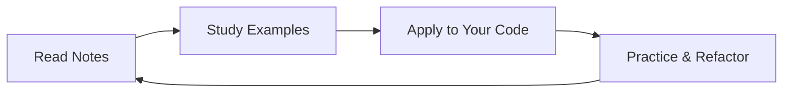

# 🧼 Clean Code – Live Lecture Notes

> **"Any fool can write code that a computer can understand. Good programmers write code that humans can understand."** - Martin Fowler

This repository contains live-class notes based on the Udemy course **"Writing Clean Code"** by Academind (Maximilian Schwarzmüller). The goal is to reinforce key principles through real-time explanations, examples, and hands-on learning.

## 🎯 Course Overview

This course emphasizes writing code that's easy to read, understand, and maintain—not just by computers, but by humans (you and your team).

### 📋 Topics Covered

- ✅ **Meaningful naming** (variables, functions, classes)
- ✅ **Effective commenting** (minimal but impactful)
- ✅ **Clean formatting and structure**
- ✅ **Small, single‑responsibility functions**
- ✅ **Proper control‑flow** (guards, avoiding deep nesting)
- ✅ **DRY principle** (Don't Repeat Yourself)
- ✅ **Side‑effect minimization**
- ✅ **Error handling best practices**
- ✅ **Data structures vs objects**
- ✅ **Class cohesion and SOLID principles**
- ✅ **Law of Demeter & other clean‑code patterns**
- ✅ **Real‑world transformations** from "bad → good" code

> **Languages:** Examples span Python, JavaScript, and TypeScript

## 🗃️ Repository Structure

```
clean-code/
│
├── 📄 README.md          # You're here!
├── 📚 notes/             # Markdown files per lecture (organized by topic)
│   ├── 01-naming.md      # Naming conventions & best practices
│   ├── general.md        # Core clean code concepts
│   └── mottos.md         # Clean code philosophy & motivation
│
└── 💻 examples/          # Code snippets and before/after clean‑ups
    └── naming/
        ├── bad_name.js   # ❌ Poor naming examples
        └── good_name.js  # ✅ Good naming examples
```

## 📚 How to Use This Repo

### 🚀 Getting Started

1. **Clone the repository:**

   ```bash
   git clone https://github.com/yourusername/clean-code.git
   cd clean-code
   ```

2. **Follow the learning path:**
   - 📖 Read notes in the `notes/` folder sequentially
   - 💻 Study corresponding code samples in `examples/`
   - 🔄 Review "bad → good" transformations for better understanding
   - 🎯 Apply principles to your own code

### 📖 Learning Workflow



## 🧩 Contributors & Collaboration

We welcome contributions! Feel free to add examples, improve notes, or suggest improvements.

### 🤝 Contributing Guidelines

- Use pull requests and follow basic clean‑code standards
- Name things clearly and meaningfully
- Keep functions small and focused
- Add meaningful comments where necessary
- Test your examples before submitting

## ✅ Prerequisites

- **Programming Experience:** Familiarity with at least one programming language (Python, JS, TS)
- **Version Control:** Basic Git experience for collaboration
- **Mindset:** Open to learning and improving code quality
- **Clean Code Knowledge:** No prior clean‑code knowledge required

## 🎓 Why Clean Code Matters

> **"Clean code is simple and direct. Clean code reads like well-written prose."** - Robert C. Martin

Writing clean code isn't just about elegance—it directly impacts:

- 🔧 **Maintainability** - Easier to modify and extend
- 📖 **Readability** - Faster to understand and debug
- 👥 **Team Collaboration** - Better code reviews and onboarding
- 🚀 **Performance** - Often leads to more efficient solutions
- 💰 **Business Value** - Reduces technical debt and development time

Your future self (and others) will thank you! 🎉

## 🎁 Resources

### 📚 Recommended Reading

- [**Clean Code** by Robert C. Martin](https://www.amazon.com/Clean-Code-Handbook-Software-Craftsmanship/dp/0132350882/)
- [**Refactoring** by Martin Fowler](https://www.amazon.com/Refactoring-Improving-Existing-Addison-Wesley-Signature/dp/0134757599)

### 🎥 Course Materials

- [**Udemy Course: Writing Clean Code – Academind**](https://www.udemy.com/course/writing-clean-code)
- [**Course GitHub repo:** academind/clean-code-course-code](https://github.com/academind/clean-code-course-code)

### 🔗 Additional Resources

- [**SOLID Principles Guide**](https://en.wikipedia.org/wiki/SOLID)
- [**Clean Architecture** by Robert C. Martin](https://www.amazon.com/Clean-Architecture-Craftsmans-Software-Structure/dp/0134494164)

## ⚡ How to Contribute

1. **Fork** this repository
2. **Create** a feature branch (`git checkout -b feature/amazing-feature`)
3. **Add** your notes, code examples, or improvements
4. **Commit** your changes (`git commit -m 'Add amazing feature'`)
5. **Push** to the branch (`git push origin feature/amazing-feature`)
6. **Open** a Pull Request

### 📝 Contribution Checklist

- [ ] Code follows clean code principles
- [ ] Examples are clear and well-documented
- [ ] Notes are accurate and helpful
- [ ] No typos or grammatical errors
- [ ] Examples are tested and working

## 📄 License

Distributed under the MIT License. See [LICENSE](LICENSE) for details.

---

<div align="center">

**🎉 Let's keep our code clean and understandable!**

[](https://github.com/denizcansever/clean-code)
[](https://github.com/denizcansever/clean-code)
[](https://github.com/denizcansever/clean-code/issues)

_Made with ❤️ for the developer community_

</div>
